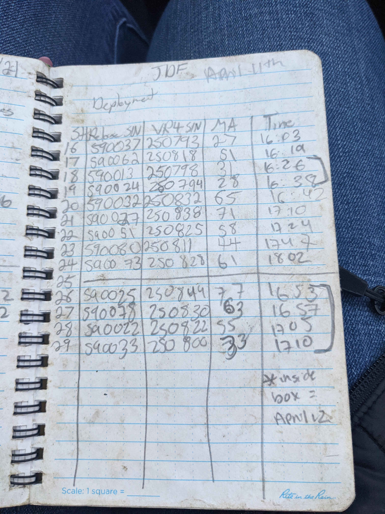

# Metadata Reporting and Best Practices

## Reporting Data to an OTN Node

Researchers who are part of the OTN Network are encouraged to register their projects and report data and metadata in a timely manner to their Data Manager. This will benefit all researchers in the region through the database's detection-matching system.

**This presentation** [Reporting to OTN](../files/field_workshop_2022_04.pptx) will cover some of the following topics.

You are encouraged to read the [OTN FAQs Page](https://members.oceantrack.org/faq) for more information.

### How to register with the OTN Database

In order to register a project with OTN, we require 3 metadata types:

1. project metadata
1. instrument deployment metadata
1. tagging metadata

See the templates [here](https://members.oceantrack.org/data/data-collection).  OTNDC@DAL.CA is the best contact for assistance

### What is the benefit of registering with the OTN Database?

OTN and affiliated networks provide automated cross-referencing of detection data with other tags in the system to help resolve "mystery detections" and provide detection data to taggers in other regions. OTN's Data Manager will also extensively quality control submitted metadata for errors to ensure the most accurate records possible are stored in the database. OTN's database and Data Portal website are excellent places to archive datasets for future use and share with collaborators. We offer pathways to publish datasets with [OBIS](https://obis.org/), and via open data portals like ERDDAP, GeoServer etc. The data-product format returned by OTN is directly ingestible by analysis packages such as [glatos](https://github.com/ocean-tracking-network/glatos) and [resonATe](https://gitlab.oceantrack.org/otndc/resonate) for ease of analysis. OTN offers support for the use of these packages and tools.

## Metadata Tips and Tricks

Here are some field-specific guidelines for completing metadata. The OTN Field team has their own metadata format, based on the Shortform Template, but containing OTN-specific columns, which is used for many projects. The OTN-Field deployment metadata sheet is available [here](https://gitlab.oceantrack.org/otnfield/OTN_Field_Ops/-/wikis/Metadata%20Templates).

If you are unsure of what information to put in a column, refer to the `Data Dictionary` tab of the metadata for other instructions.

### Upon Deployment

When a mission contains deployments, there is some information needed:

- exact waypoint lat/long of deployment (will often differ from the intended location, and is taken from ship's gps or similar)
- the deployment date and time (in UTC)
- the serial numbers of all instruments
- information about the depth of the water and the riser used (all in meters). **Hint**: the instrument_depth should always be equal to bottom_depth minus riser_length.

OTN staff have had great success with recording deployments properly.

### Upon Recovery

When a mission contains equipment recoveries, there is some information needed:

- the recovery date and time (in UTC)
- an indicator about the success of the recovery and notes to accompany this

OTN staff have had great success with recording recoveries properly.

### Download-only Missions

When a mission contains stations which are remotely downloaded, metadata still needs to be completed:

- the download date and time (in UTC)
- and indicator about the success of the download, and notes to accompany this

For deployments where multiple remote downloads occur (5-year VR4 moorings), on each download, you replace the previously listed download date in the metadata with the new date and accompanying comments.

### Lost or Found Gear

Generally, equipment is marked with a `y` in the recovery indicator column if recovery is successfully completed during a mission, or `n` if recovery has not yet been attempted for the specific mooring. There are other cases which need special consideration in the metadata:

Recovered equipment:

 - please enter `y` to indicate successful recovery of the mooring.
- if the mooring was recovered but is damaged (ex: flooded equipment) please indicate this in the data_downloaded column with an `n` and include comments

Non-recovered equipment:

- please enter `n` if recovery has not yet been attempted for the specific mooring
- if there is no communication from a mooring, please mark it as `lost` in the recovered (y/n/l) column and include comments. If this lost mooring is later found on station, it can be changed to `found` or another indicator
- if a mooring is “stuck” (release has no communication but the receiver is still communicating), please mark it as `failed` in the recovered (y/n/l) column and include comments
- if a mooring was attempted but not recovered for logistical reasons, but it could be on-station (either stuck or recoverable) then enter `unknown` in the recovered (y/n/l) column and include comments. The `unknown` status will indicate that more investigation is needed to determine if the mooring is `lost`, `failed`, or can be recovered, and therefore this mooring will need to be serviced again at a future date.

Found equipment:

- if a fishing vessel drags up or reports catching the mooring, please mark it as `caught` in the `recovered (y/n/l)` column and include comments 
- if a receiver is found on a shoreline, please mark it as `found` and include comments

Other accepted terms include `moved`, which is used when a mooring is recovered successfully, but was a substantial distance from its deployment location suggesting fishing interactions or movement during a storm.

### OTN specific-columns

Mission IDs for both the recovery and deployment missions are helpful to ensure we're able to link the mission report (notes) to the deployment history. These fields aren't mandatory but can be very useful internally!

Consecutive deployment number is helpful for tracking stations which have been rolled-over and those which haven't yet, but is not a mandatory field.

## Raw Field Notes

Often, typos are introduced into metadata sheets while being transcribed. This means that the true information is only found in the raw field notes, contained in muddy write-in-the-rain notebooks. These are easily lost and not easily searchable.

For these reasons, it is **strongly encouraged** to take a photo of the field notes at the end of the mission and upload it to the project's Data Portal repository folder for safe-keeping. These can be used to untangle metadata mysteries that might occur, and will preserve this information when projects are handed between technicians.


