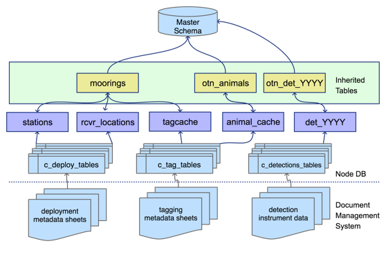
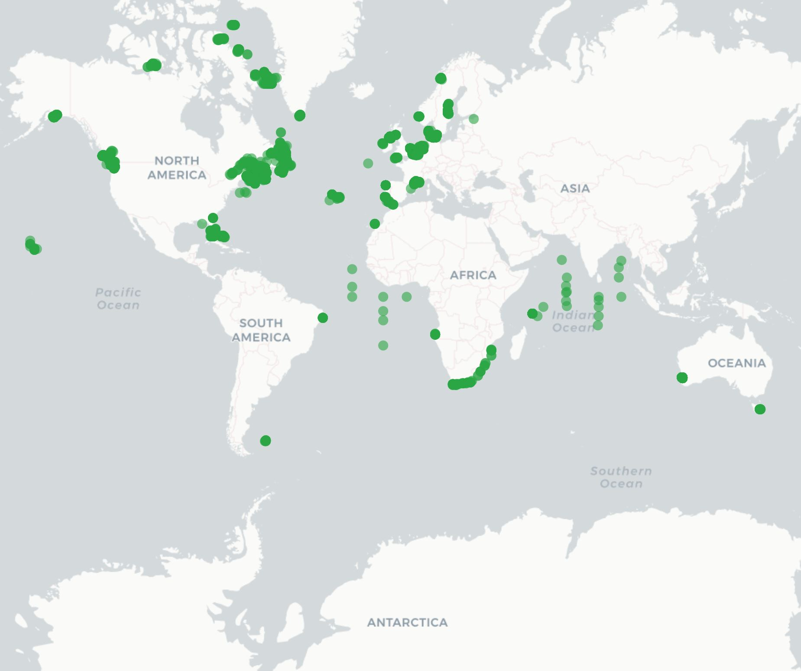

# OTN Data System 

The OTN data system is an aggregator of telemetry data made up of interconnected Node Databases and data processing tools. These work together to connect researchers with relevant and reliable data. At the heart of this system are Nodes and their OTN-style Databases.

Affiliated acoustic telemetry partner Networks may become an OTN Node by deploying their own database that follows the same structure as all the others. This structure allows Nodes to use OTN's data loading processes, produce OTN data products, and match detections across other Nodes. 

# Basic Structure

The basic structural decision at the centre of an OTN-style Database is that each of a Node's projects will be subdivided into their own database `schemas`. These schemas contain only the relevant tables and data to that project. The tables included in each schema are created and updated based on which types of data each project is reporting. 

Projects can have the type `tracker`, `deployment`, or `data`. 
- Tracker projects only submit data about tag-releases and animals. They get tables based on the tags, animals, and detections of those tags. 
- Deployment projects only submit data about receivers and their collected data. These projects get tables related to receiver deployments and detections on their receivers. 
- Data projects are projects that deploy both tags and receivers and will submit data related tags, animals, receivers, and detections and will get all the related tables.

In addition to the project-specific `schemas`, there are some important common schemas in the Database that Node Managers will interact with. These additional schemas include the `obis`, `erddap`, `geoserver`, `vendor`, and `discovery` schemas. These schemas are found across all Nodes and are used to create important end-products and for processing. 
- The `obis` schema holds summary data describing each project contained in the Node as well as the aggregated data from those projects. When data goes into a final table of the project schema it will be inherited into a table in `obis` (generally with a similar name). 
- The `erddap` schema holds aggregated data re-formatted to be used to serve telemetry data via an ERDDAP data portal. 
- The `geoserver` schema holds aggregated data re-formatted to be used to create geospatial data products published to a GeoServer. 
- The `vendor` schema holds manufacturer specifications for tags and receivers, used for quality control purposes. 
- The `discovery` schema holds summaries of data across the OTN ecosystem. These tables are used to create summary reports and populate statistics and maps on partner webpages. 

The amount of information shared through the discovery tables can be adjusted based on sharing and reporting requirements for each Node.

# The Path of Data

The OTN data system takes 4 types of data/metadata: **project**, **tag**, **instrument deployments**, and **detections**. Most data has a similar flow through the OTN system even though each type has different notebooks and processes for loading. The exception to this is `project` metadata which has a more unique journey because it is completely user-defined, and must be used to initially define and create a project's `schema`.

### Project Data

`Project` data has a unique workflow from the other input data and metadata that flows into an OTN Node, it is generally the first bit of information received about a project, and will be used to create the new `schema` in the Database for a project. The type of project selected (`tracker`, `deployment`, or `data`) will determine the format of the tables in the newly created `schema`. The type of project will also impact the loading tools and processes that will be used later on. The general journey of project data is:
- To register a new project a researcher will fill out a [`project metadata` template](https://members.oceantrack.org/data/data-collection) and submit it to the Node Manager. 
- The Node Manager will visually evaluate the template to catch any obvious errors and then runs the data through the OTN Nodebook responsible for creating and updating projects (`Create and Update Projects`). 
- The `Create and Update Projects` notebook will make a new schema in the Database for that project, and fill it with the required tables based on the type of project. 
- Summary tables are populated at this time (`scientificnames`, `contacts`, `otn_resources` etc).
- After this, OTN will verify the project one last time to make sure every necessary field is filled out and properly defined.

### Tag, Deployment and Detections Data

Even though `tag`, `deployment`, and `detections` data all have their own loading tools and processes, their general path through the database is the same. 
- Their data workflows all begin with a submission of data or metadata files from a researcher. 
- The Node Manager ensures there is a copy of the file on the Node's document management website. 
- They will then do some quick visual QC to catch any obvious errors. 
- The data is then processed through the relevant OTN Nodebooks. This process is outlined by the task list associated with the GitLab Issue made for this data. 
- The data will first be loaded into the `raw` tables. This is the table that holds the raw data as submitted by the researcher (the naming convention for raw tables: they always have the prefix `c_` and will have a suffix indicating the date it was loaded, typically `YYYY_MM`). 
- After the raw data table is verified, the data will move to the `intermediate` tables which hold partially-processed data as a "staging area". 
- After the intermediate table is verified, data will move to the `upper` tables, where the data is finished processing and is in its "final form". This is the data that will be used for aggregation tables such as `obis` and for outputs such as `Detection Extracts`.

# OTN Data Products

The OTN Database has specific data products available, based upon the clean processed data, for researchers to use for their scientific analysis. 

In order to create meaningful Detection Extracts, OTN and affiliated Nodes only perform cross-matching events every 4 months (when a reasonable amount of new data has been processed). This event is called a synchronous `Data Push`. In a `Data Push`:
- All recently-loaded data is verified and updated. 
- Cross-node matching is done; where detections are matched to their relevant tag, across all Nodes. 
- Once cross-node matching is done, [Detection Extracts](https://members.oceantrack.org/data/otn-detection-extract-documentation-matched-to-animals) are created, containing all the new detections matches for each project. Detection Extract files are formatted for direct ingestion by analysis packages such as [*glatos*](https://github.com/ocean-tracking-network/glatos) and [*resonate*](https://gitlab.oceantrack.org/otndc/resonate). 
- Summary schemas like `discovery`, `erddap`, and `geoserver` are updated with the newly verified and updated data.
- Summary schema records can be used to create maps and other record overviews such as this map of active OTN receivers: 

 
 
# Backing Up Your Data

As with any database, it is important to make sure the data held by the OTN Database Node is protected. To ensure you are protected your Database and potentially the files contributed to your Node by the research community you support should be backed up properly, in the event your primary Database crashes, is corrupted, is lost, or any other unexpected event. 

You should discuss and coordinate a backup strategy with the groups or institutions responsible for your Database's administration, and find out their policies and practices for performing backups. Backup strategies may vary from group to group but it is a good idea to make sure they are adequately backing up your data **daily**, if not multiple times a day, and keep copies of backups in **different physical locations** in the case that something happens at a single location. 

OTN is happy to offer guidance and recommendations to any group.
