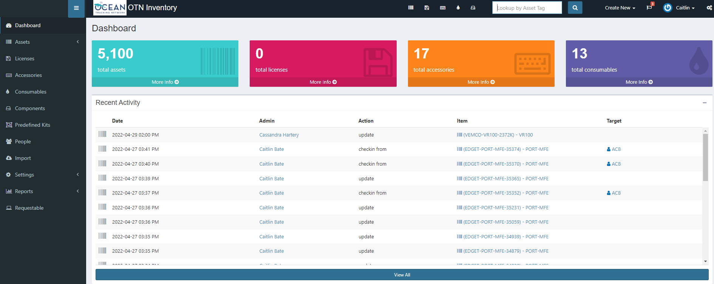

# SnipeIT Inventory System

In 2017, OTN deployed the [SnipeIT Inventory](https://ops.oceantrack.org/snipeit/) system to track equipment shipments to partners and internally. This is an open-source tool with an underlying database, which OTNDC can access for internal metrics. To ensure its success, there are a couple of additional features we should add to our regular repertoire.

## General Tasks

OTN Field technicians utilise SnipeIT on a regular basis, mainly doing the following activities.

### Checking gear in/out

When a shipment is sent to/returned from a partner, or deployed/recovered by OTN Field Ops, its important to update the project the equipment (asset) is associated with.

Checking out equipment:

- Use the left-hand menu, under `Assets` there is an option for `Bulk Checkout`
- Ensure you know the project code (`User`) or create a new user for that project - see section below.
- Search for the assets you wish to checkout to that user. Only assets who's `Status` is deployable will appear
- Press "checkout" when completed and review your work on the `Dashboard`!

If you don't know the correct collectioncode for a project please reach out to OTNDC staff to clarify.

Checking in equipment:

- Use the left-hand menu, under `Assets` there is an option to `List All`
- Here you can use the search bar in the top and type in the asset's serial number
- Once you find the asset, click on the `Asset Tag` to see the asset page
- Choose the `Actions` button in the top-right
- Choose `Checkin Asset`
- Select an appropriate `Status` for the asset (in house, RMA, deployable, ready to deploy etc).
- Press "checkin" when ready, and review your work on the `Dashboard`!

### Changing status of equipment

Sometimes, you need to change the status of equipment in order to checkout the asset. The status will also need to be changed for units which are being shipped for RMA, or are lost.

- Use the left-hand menu, under `Assets` there is an option to `List All`
- Here you can use the search bar in the top and type in the asset's serial number
- Once you find the asset, click on the `Asset Tag` to see the asset page
- Choose the `Actions` button in the top-right
- Choose `Edit Asset`
- Select an appropriate `Status` for the asset (in house, RMA, deployed, ready to deploy, etc).
- Press "save" when ready, and review your work on the `Dashboard`!

## Batch Import

When a new order of equipment has been received, its important to import the assets to the inventory as quickly as possible, so they can be shipped and deployed without issue.

### Import Template

In order to use the batch import function, a `.csv` file needs to be created, following this standard template - [Snipe Asset Import Template](../files/Asset_import_example.csv)

The mandatory columns and their formats are:

- `serial number`: numeric and unique, like `250688`
- `category`: one of Acoustic Release, Acoustic Receiver Deckbox, Transducer, Acoustic Transceiver, or Deckbox/Hydrophone
- `manufacturer`: one of Vemco, Edgetech, Benthos, Seabird, Star Oddi, Subsea Sonics etc. You can see a list of manufactuers [here](https://ops.oceantrack.org/snipeit/manufacturers/)
- `model name`: short name for model, like `VR4`, `VR2AR`, `PORT-MFE` etc.
- `full model`: model from the vendor specifications, like `VR4-UWM-100-BAT-LI`
- `asset tag`: **vendor (shortened if needed) + model name + serial number**, like `VEMCO-ASCENT-1234356`, or `EDGET-PORT-MFE-34429`.
- `mftr no`: vendor sales order, like `34561`
- `purchase date`: in format YYYY-MM-DD
- `purchased for`: project code. can be blank
- `status`: Ready to Deploy, Deployed, In House, RMA etc. You can see a list of status labels [here](https://ops.oceantrack.org/snipeit/statuslabels/)
- `checked out to`: project code - based on the list of `Users` in Snipe. can be blank if the asset is not yet assigned to a project.
- `date shipped`: in format YYYY-MM-DD. can be blank
- `expected return`: in format YYYY-MM-DD. can be blank
- `notes`: freeform text. Please include transmitter ID (ex: A69-9001-12345) here if relevant (VR2ARs, VR2TXs, HR2s etc)
- `purchase cost`: numeric price per unit, like `123.00`
- `order number`: Dalhousie PO number, like `P09134476`

You may edit the file in Excel, but please save as a `.csv` when you are finished. This will eliminate all special characters and formatting. If you have any issues, please reach out to OTNDC staff.

### Batch Import Steps

- Use the left-hand menu there is an option to `Import`
- Choose `select import file` and browse for the file on your computer
- Once you have selected the import file you will be taken back to the main `Import` dashboard
- Now, you must find your file in the list on the Dashboard (should be at the top!) and press `Process`
- Ensure that you map all the column names to their correct SnipeIT database field (some may be auto-mapped).
- Once the processing has been successful, review your work on the `Dashboard`!

If you have any issues, please reach out to OTNDC staff.

## Creating New Users

When there is a new project receiving OTN equipment, this project will need a `User` in SnipeIT.

Creating a new user:

- Use the left-hand menu, choose `People`
- There are two options to create a User:
	1. Clone an existing User by clicking on its name and choosing `Clone User` from the right-hand menu
	1. Create a new user by clicking `Create New` on the current user dashboard page
- Either way, to create a User you need to fill out the following mandatory fields:
	* Firstname = project collectioncode
	* Username = project collectioncode
	* Email = if required, put otndc@dal.ca here
	* Password = anything random! no one will need to login
	* Confirm Password = match above! no one will need to login
	* Unselect the "Login enabled" button - no one will need to login
	* OPTIONAL: add some notes
- Press `Save` and you can now checkout equipment to this project!

If you have any issues, please reach out to OTNDC staff.

## Fixing Errors in SnipeIT

The SnipeIT underlying database is backed up periodically by Dal IT staff, so the history is possible to recover if you make an error. However, its possible that the problem is easily fixable, depending on what happened! If you're unsure, please reach out to OTNDC staff. Currently, Brian Jones is the staff member responsible for Snipe.


