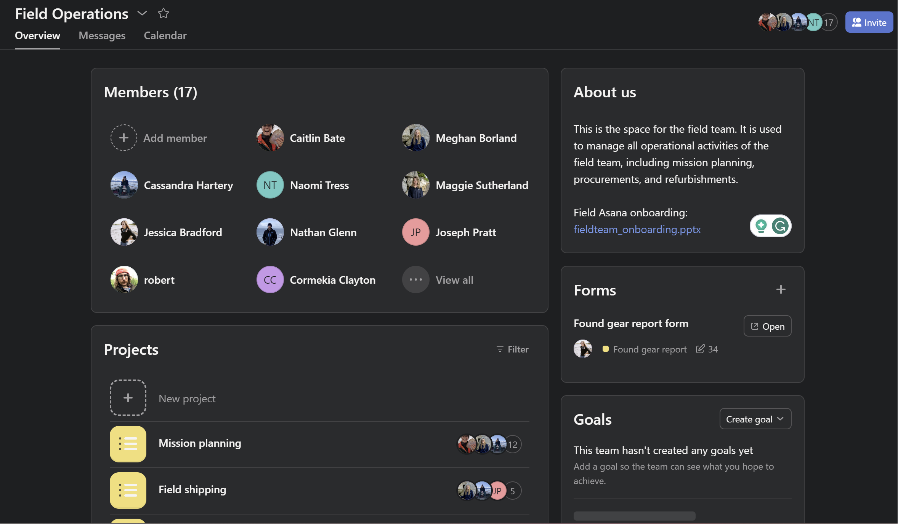
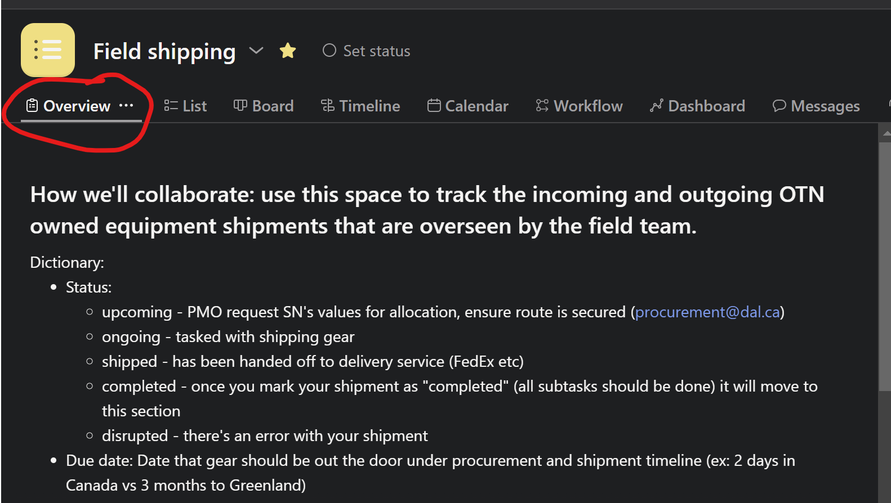
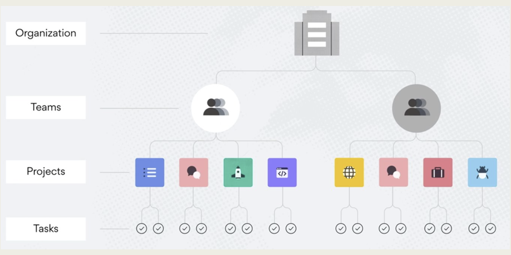

## OTN's Asana

At OTN, Asana is used for internal record keeping and collaborative action item tracking.  

Asana allows us to be accountable, thorough, and comprehensive in our processes. This is essential for smooth communication and acts as a searchable archive of OTN's institutional memory. Asana has replaced Podio and GitLab for the Field Team.

Why Asana?
* Enable automation and streamline workflows 
* Enhance organizational cohesion  
* Increase accountability and awareness of who is responsible 
* Minimize duplication of effort at the individual and organizational levels 
* Integrate existing tools (e.g., Slack, OneDrive) 
* Powerful tool for collaborative working and task management 

OTN has several relevant Asana Teams, beyond `Field Operations` (described below), that you will need to interact with.
- **OTNHQ:** a space for HQ-wide resources, including communications resources, swag inventory tracking, and onboarding/offboarding processes.
- **Key Performance Indicators:** the space to track all KPIs to ensure they roll into the KPI dashboard.
- **Field Management:** the place where all loaner-operations are tracked and managed. This team is extremely important, and relates directly into the `Projects` within Field Operations (ex: Shipping).

## Field Operations Team

As the Field team has grown, job descriptions have expanded, and remote work has become more common it is now important to start using some of the lessons learned by the Data team to improve Field Ops communications. For this reason, there is now a **Field Team Asana**  - [https://app.asana.com/0/1201938039482799/overview](https://app.asana.com/0/1201938039482799/overview).

Each OTN Field team member should have an Asana account created - please contact Project Management.

This Field Ops Asana has been created as a place to track complex / important / outstanding issues so that they can be contributed to collaboratively and archived for future reference. This will be used in addition to Slack to make sure all Field Team members are communicating and information does not slip between the cracks of our busy schedules.

Asana projects include:

- **Mission Planning:** forecast for upcoming missions, the field lead, and the required details needed leading up to the mission.
- **Field Shipping:** track the incoming and outgoing OTN owned equipment shipments that are overseen by the field team. 
- **Procurement:** keep track of equipment and consumables that need ordering, are incoming or have been received. 
- **Consumable/Inventory Supply:** use this space in tandem with Procurement for consumable items to ensure we have all required equipment for upcoming missions.
- **Found Gear Report:** submit and keep up with found gear reports, ensuring their return status to OTNHQ and reward payments.
- **Refurbishments:** keep track of necessary refurbishments of OTN owned equipment. 
- **Equipment/Supply sign out:** keep track of mission based equipment within the OTN field team. 
- **Safety Equipment Inventory:** keep track of mission based equipment within the OTN field team. 
- **Registrations and Certifications:** keep track of registrations/certifications and their expiration date. 
- **Truck:** use this space to ensure that all truck/trailer registrations and upkeep are documented and up-to-date.
- **RMA:** track the status, and serial numbers, for all RMAs.
- **Receiver Inventory (@ HQ):** relevant for Field Management - how many instruments of each model do we have in-house?
- **TOIL:** Use this space to keep track of your accumulated Time Off in Lieu.

You will likely use the `Field Shipping`, `Mission Planning`, `Found Gear Reporting` and `TOIL` projects most often.

## Exploring Projects

Each Project in Field Operations should include information in an `Overview` tab. This will detail exactly how to use this project, and how to complete the `Tasks` within it. This will differ for each project and therefore will not be covered in this curriculum.

Current members of this Asana Project include: all Field staff and members of the Project Management Office. Please tag them in any tasks (using the @ symbol) to prompt them for input.

## Tasks 
Within each project there are `Tasks` - these are the action items, and often contain subtasks with deadlines for completion. A `Task` may be defined differently in different projects - Ex: in `Found Gear Reporting` each task is one "washup". In Receiver Inventory it's a specific model of receiver.

Often, there is automation built into the creation of `Tasks` or `Subtasks` in a project. This helps us remember _when_ we can complete each step of our action item. A great example is the `Field Shipping` project. Once a shipment's status is changed to `Active shipment` then additional subtasks are populated for the assignee to follow. Similarly, if the shipment is labelled as Incoming vs. Outgoing there are different subtasks automatically created and so forth.

Tasks can be reassigned when needed to ensure they're not forgotten when a staff member goes on vacation or on a field mission.

You can see all `Tasks` and `Subtasks` assigned to you, with their due dates, in the left-hand menu option `My Tasks`. **You need to check these every day to ensure you are not missing tasks assigned to you by Project Management or other teams.**

## More Information

The Field Ops Asana has a [Onboarding Powerpoint](https://dalu-my.sharepoint.com/:p:/r/personal/cr680210_dal_ca/Documents/Meeting%20Minutes/Field%20Team%20Meeting%20Minutes/OTN%20Field%20Ops%20Meeting%202023/Retreat/fieldteam_onboarding.pptx?d=wb856573287bb42b7b96ade10cfcc785d&csf=1&web=1&e=s1n2r9) with all the details needed to learn how to navigate Asana!


