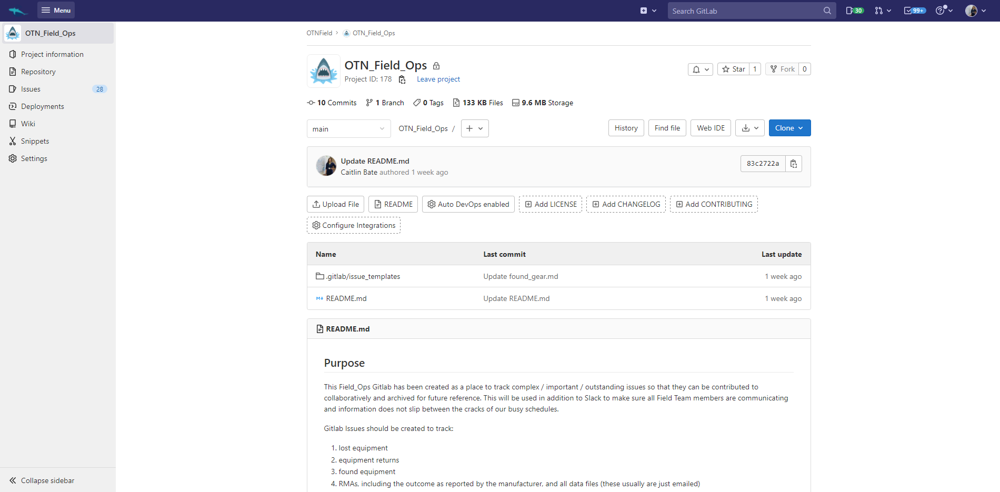
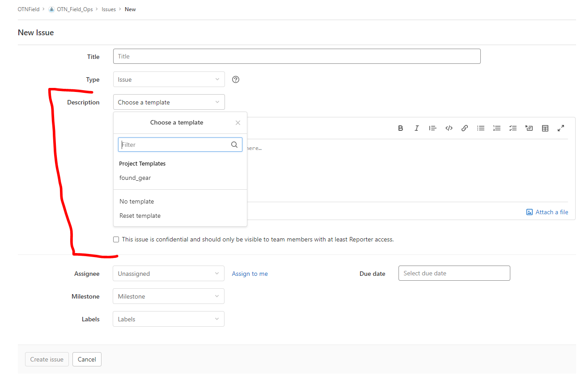

## OTN's GitLab

At OTN, GitLab is used for internal record keeping and collaborative code development. The main purpose (for non-computer scientists at OTN) is the ability to use GitLab Issues containing templates of task-lists to ensure the DAQ team NEVER forgets a step in data loading, and that no file is ever lost/forgotten in an inbox. We track all communications with researchers and archive all important information for future use.

GitLab allows us to be accountable, thorough, and comprehensive in our data-loading process. This is essential for smooth communication and acts as a searchable archive of OTN's institutional memory.

## Field Ops Gitlab

As the Field team has grown, job descriptions have expanded, and remote work has become more common it is now important to start using some of the lessons learned by the Data team to improve Field Ops communications. For this reason, there is now a **Field Team GitLab** project - [https://gitlab.oceantrack.org/otnfield/OTN_Field_Ops](https://gitlab.oceantrack.org/otnfield/OTN_Field_Ops).

Each OTN Field team member should have a GitLab account created - please fill out this [signup form for an account on GitLab](https://gitlab.oceantrack.org/users/sign_up) if you don't have an account already.

This Field Ops Gitlab has been created as a place to track complex / important / outstanding issues so that they can be contributed to collaboratively and archived for future reference. This will be used in addition to Slack to make sure all Field Team members are communicating and information does not slip between the cracks of our busy schedules.

Gitlab Issues should be created to track:

- lost equipment
- equipment returns
- found equipment
- RMAs, including the outcome as reported by the manufacturer, and all data files (these usually are just emailed)
- deployment or metadata issues / questions from PIs that need digging into
- outstanding purchase orders
- anything that is too complicated to track via email and/or involves too many people

Current members of this Gitlab Project include: all Field staff, members of the Project Management Office, some members of the Data Team. Please tag them in an issue (using the @ symbol) to prompt them for input.

Field team members leave (for vacation, or permanently) and so a shared record of important events will be essential to ensure knowledge-transfer. Having the information in your email is a great first step, but it may become lost or buried and is not easily shared/searched by colleagues.

## How to Use GitLab

Menu on the left-hand sidebar:
- `Project information` allows changes to Members and permissions
- `Repository` contains Issue templates
- `Issues` contains all ongoing (and completed) Issues!
- `Deployments` is not used
- `Wiki` contains helpful documentation and links for you!
- `Snippets` can contain standard text blocks (email templates), code blocks (quick DB queries), or other things
- `Settings` allows changes to the functionality of the GitLab Project

Top menu banner:
- Shows your main `Menu`, with all the GitLab projects of which you are a member
- Has a `search` function, which can be used to find Issues using keywords
- Has your personal `Issue Dashboard` with all Issues assigned to you
- Has personal and `account` Settings

**You will use the `Issues` and `Wiki` left-hand sidebar options, and the personal `Issue Dashboard` in the top menu banner (right side) most often.**

## Issue Templates

For tasks that are repeated (Canadian shipments, international shipments, returning equipment, washups, Fedex insurance claims etc) the same set of steps are often required each time. GitLab Issues have an option to populate with a standardized `template checklist`.

Currently, the Field Ops GitLab only has one template, for `found_gear`, and some common `shipping` tasks. However, if this is deemed successful we can expand.

### Using Issue Templates

When you navigate to `Issues` on the left-hand sidebar menu, there will be an option to create a `New Issue`. By choosing the New Issue button in the top-right of your screen, you will be taken to a new, blank, issue form. To fill out the fields you will need to do the following:
- Title (something informative, ex: HFX washup 2022-04)
- Type: No need to edit this field, should be type `Issue`.
- Description: If if you wish to use a pre-made checklist `Template`, you will choose it here, using the drop down menu. Ensure you choose the relevant checklist for the type of issue you are creating (ex: found_gear). This will populate the large description field! 
- Milestone: These can be setup to be deadlines, but can be left blank
- Labels: This is for your reference - choose a label that will help you remember the reason this issue exists. Some common examples include `FOUND GEAR`, `Data/Metadata Problem`, `Legal`, `RMA` etc. You can create new labels at any time to help categorize the Issues!

Now, with all information completed, you can select Create Issue.

## GitLab Wiki

The Field Ops GitLab has a [Wiki page](https://gitlab.oceantrack.org/otnfield/OTN_Field_Ops/-/wikis/home) where important files, templates, and procedures are outlined. Currently, there are several resources available to assist with day-to-day activities for the Field Team:

- Metadata Templates
- Shipping Procedures
- Lost & Found Gear Report Form
- ROV/SSS Reporting
- link to the OTN Wiki SOPs

Theoretically, this curriculum should cover the same content as the Wiki, but the Wiki is a good reference as well and can be edited to contain any information deemed important.


