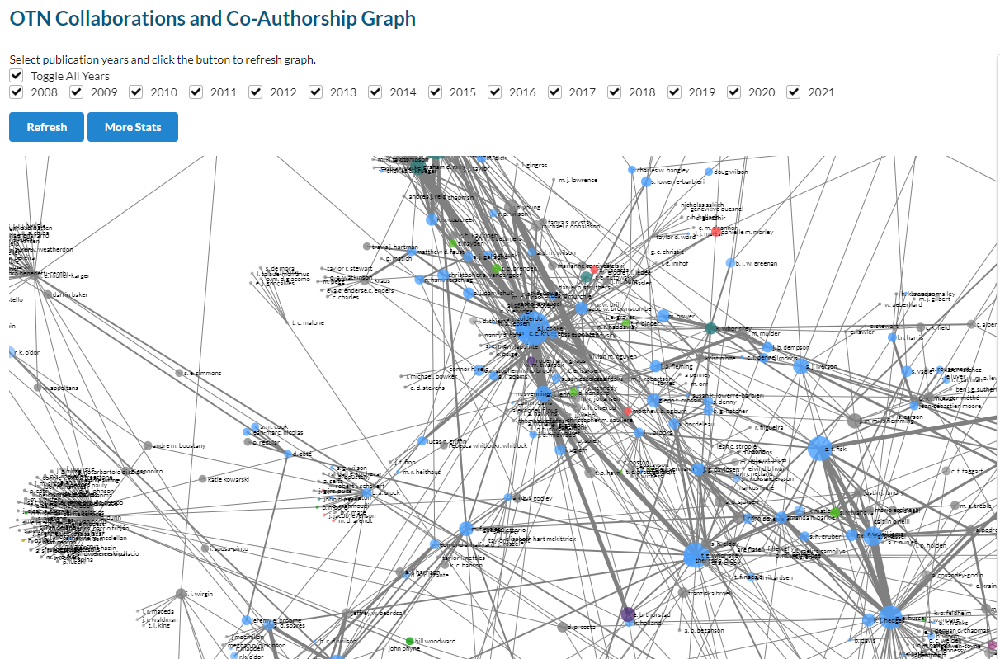

## KPI Dashboard

OTNDC has developed an interactive web-based dashboard for Project Management staff called the `OTN Ops Dashboard`. It is available at [this link](https://ops.oceantrack.org/kpiDashboard/login?next=/kpiDashboard/viewKPI) and has a shared username and password for all OTN Staff.

This curriculum is public, so we cannot add the login credentials here, but please email OTNDC@Dal.ca for information if you are interested.

**Note**: this is for internal use only! The output from any of these KPI tools can **not** be shared externally without first discussing with Project Management or OTNDC.

### View KPI

The default summary page is the `KPI Dashboard`. This has a drop-down menu for each fiscal year, and contains Key Performance Indicator statistics which are required for annual reporting to CFI. These are pulled from the KPI reports on Asana as well as the annual report survey sent out to all partners.

Metrics here include:
- HQP Trained
- Number of employees
- User satisfaction
- Number of resolved detections
- Shiptime hours

### Exporting Tool

The `Exporting Tool` menu option is to export the results from the KPI Dashboard in an Excel document. This is used by managers for reporting.

### Admin Tools

The `Admin Tools` menu option is for OTNDC and Project Management staff only - allowing them to edit the targets for each KPI and other settings.

### Receiver Report Tool

The `Receiver Report Tool` has a direct link to the OTN Database, and can be used to search all the deployments in our database. You can search in three ways:

1. Search by collection codes (and/or year) to show all deployed receivers (owned by OTN or not!) for a certain project(s)
1. Search by receiver serial numbers (and/or year) to show all deployments of a certain receiver(s), across all projects
1. Search by both collection code and receiver serial number

You are able to export as an XLSX, and soon as a CSV as well.

**TIP: use this to track down shipping chaos - where has a receiver been reporting?**

### Receiver Efficiency Index Tool

This `Receiver Efficiency Index Tool` was developed to determine which stations are performing the best and worst in an array. This is based on the calculations presented in [Kendall et al. 2021](https://doi.org/10.1016/j.fishres.2020.105802)

This tool allows you to choose a collection code and date range, and either view or export an interactive map displaying the "hot spots" of detection activity (yellow colour) in your array. This is important for OTN to use for array reconfiguration evaluations.

### Bibliography Graph

The `Bibliography Graph` is the newest tool added to the Ops Dashboard. It is an interactive network plot showing the publications by OTN researchers, with links between researchers who have co-authored papers. Researchers who publish more have larger dots in the graph. The researchers are coloured according to their Network membership.

There several interactive filter options including by year. There are likely to be more developments on this tool in future.

## Future Tools

This Dashboard is meant to serve as an internal mechanism for non-Data colleagues to view and understand data held in our databases. Are there more summaries you'd like to see here? Some ideas are:

- Battery life for receivers ("what will need servicing soon?")
- Age of receivers 
- Date of last offload/mission ("what stations haven't been check in a while?")

This is meant to serve you! You can voice ideas at anytime by reaching out to OTNDC or creating an Issue in the [kpi-dashboard GitLab project](https://gitlab.oceantrack.org/otndc/kpi-dashboard/-/issues).


