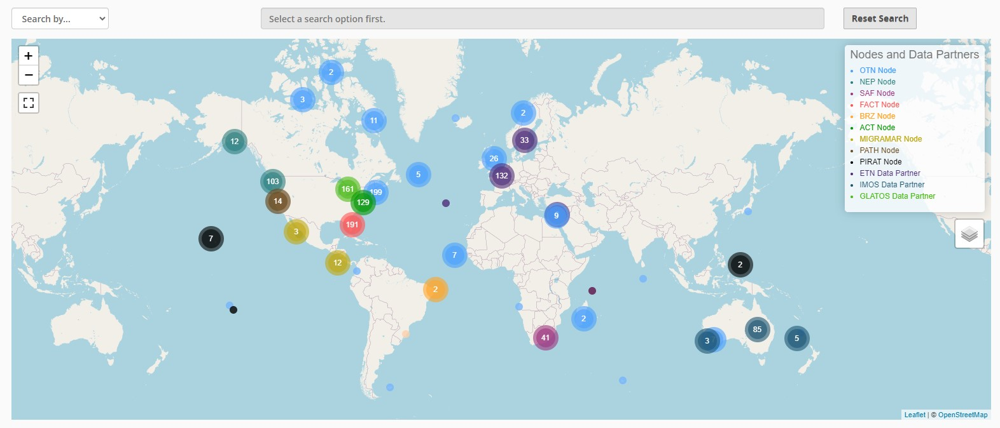

## What is a Node?

OTN partners with regional acoustic telemetry networks around the world to enable detection-matching across our communities. An OTN Node is an exact copy of OTN's acoustic telemetry database structure, which allows for direct cross-referencing between the data holdings of each regional telemetry sharing community. The list of OTN Nodes is available at [https://members.oceantrack.org](https://members.oceantrack.org). Data only needs to be reported to one Node in order for tags/detections to be matched across all.

### How does a Node benefit its users?

OTN and affiliated networks provide automated cross-referencing of detection data with other tags in the system to help resolve "mystery detections" and provide detection data to taggers in other regions. OTN Data Managers extensively quality-control submitted metadata to ensure the most accurate records possible are stored in the database. One of the biggest benefits of interconnected Nodes is that researchers only need to report their records to ONE OTN style Node. OTN's database and Data Portal website are well suited for archiving datasets for future use and sharing with collaborators. 

The OTN system includes pathways to publish datasets with OBIS, and for sharing via open data portals such as ERDDAP and GeoServer. The data-product format returned by OTN is directly ingestible by analysis packages including glatos and resonATe. OTN offers continuous support for the use of these packages and tools.

For your interest, we have included here a presentation from OTN and FACT Managers, describing the relationship between OTN and its Nodes, the benefits of the Node system as a community outgrows more organic person-to-person sharing, as well as a realistic understanding of the work involved in hosting/maintaining a Node.

- [YouTube Recording](https://youtu.be/sIYCGvLz9SQ) 

## Node Managers

To date, the greatest successes in organizing telemetry communities has come from identifying and working with local on-the-ground Node Managers for each affiliated Node. The trusted and connected 'data wranglers' have been essential to building and maintaining the culture and sense of trust in each telemetry group.

Node Managers have been trained from groups including FACT, ACT, SAF, PATH, PIRAT and MigraMar.  OTNDC staff assist with node management for NEP, SAF, MigraMar and OTN.  

## Node Training

Each year OTN hosts a training session for Node Managers. This session is not only for new Node Managers, but also a refresher for current Node Managers on our updated tools and processes. The curriculum is available [here](https://ocean-tracking-network.github.io/node-manager-training/).

## Data Partners

In addition to OTN-supported nodes, we partner with numerous telemetry networks to ensure that effort and science is shared regardless of disparate database structures. Data system cross-walk efforts continue with ETN, IMOS and GLATOS.


